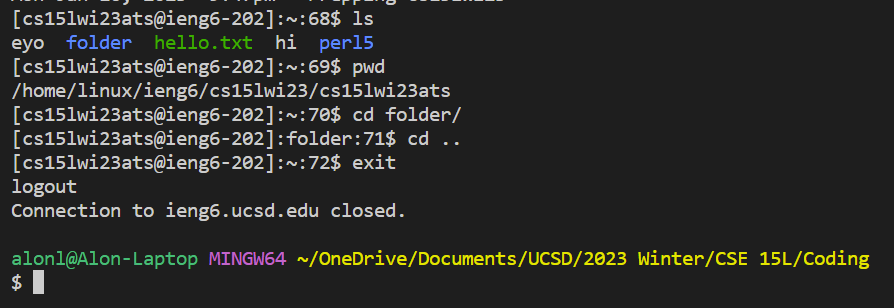

# Week 3 Lab Report

## Command: find

### type ___
This flag filters all files by their type, AKA only looks at one file type as specified  after

Example #1:

`$ find -type f`


This command will find and display all files that are of type file which is why the arguement is "f". This excludes things like directories, pipes, and device files. 


Example #2:

`find -type d`


This command will find and display all directories which is why the arguement is "d". This is useful as it shows all directories that are deeper inside than just the working directory.


### perm ___
This flag will search for any files with the given permission code.

Example #1:

`find -perm 755`


This command will find and display all the files that have the permission "755" or "rwxr-xr-x" permissions

Example #2:

`find ! -perm 644`


This command will find and display all the files that do not have the permission of "644" or "-rw-r--r--" permissions.


### exec ___
This flag will execute any command given to it on the files found by find.

Example #1:

`find -name "*.txt" -exec grep -Hi shalom {} \;`

This command will execute the command of `grep` onto the list of files returned by `find` which in this case will return all the sections in which the word `shalom` shows up. The file paths will show because of the `-H` and the `-i` will ignore the case of the pattern and the input files.


Example #2:

`find -name “*.txt” -exec chmod 777 {} \;`


This command will find all the files that end in `.txt` and execute the chmod command on them turning their permissions to "777" or "rwxrwxrwx".


### -size ___
This flag will search for any files that corresponds to the given input size.

Example #1:

`find -size +100k`

This command will return and display all the files that have a size of more than 100 kB


Example #2:


`find -size +50k -size -75k`

This command will return and display all the files that have a size of more than 50 kB and less than 75 kB


## Extra

### empty


I always make empty files so it would be nice to find them using this

## Resources:
- https://alvinalexander.com/unix/edu/examples/find.shtml#:~:text=The%20%2Dtype%20f%20option%20here,f%20option%20off%20your%20command. 
- https://linux.die.net/man/1/grep 
- https://man7.org/linux/man-pages/man1/find.1.html 
- https://www.redhat.com/sysadmin/linux-find-command 
- https://www.tecmint.com/35-practical-examples-of-linux-find-command/ 


# Week 2 Lab Report

## Part 1
Code for the StringServer:
```
import java.io.IOException;
import java.net.URI;

class Handler implements URLHandler {
    // The one bit of state on the server: a number that will be manipulated by
    // various requests.
    String str = "";

    public String handleRequest(URI url) {
        if (url.getPath().equals("/")) {
            return String.format("String: %s", str);
        } else if (url.getPath().equals("/add-message")) {
            System.out.println("Path: " + url.getPath());
            String[] parameters = url.getQuery().split("=");
            if (parameters[0].equals("s")) {
                str += parameters[1];
                str += "\n";
                return String.format(str);
            }
        } else {
            return "404 Not Found!";
        }
        return String.format("404 Not Found!");
    }
}

class StringServer {
    public static void main(String[] args) throws IOException {
        if(args.length == 0){
            System.out.println("Missing port number! Try any number between 1024 to 49151");
            return;
        }

        int port = Integer.parseInt(args[0]);

        Server.start(port, new Handler());
    }
}
```

Methods called:
 - I went to the following URI: http://localhost:4000/add-message?s=Hello
 - When I access this specific URL it calls the Handler class which called the handleRequest method
 - The handleRequest method takes in the URL and is able to extract information from it

Relevant Arguments:
 - The relevant arguements for this is the "/add-message?s=Hello"
 - My code is able to take that arguement and understand that I want to add a message to my overall string as the path is "/add-message"
 - Then we see the query which is "?s=Hello" which my code separates into two arguments by dividing it around the "="
 - Then we know that what follows the "s=" will be the string that I want to add therefore I add "Hello" to my global string
 - Finally I concatinate "\n" to add a new line so that any future additional messages will appear on a new line
 - In total the only field changed is the `str` variable as the inputted string gets added as well as the URI


Methods called:
 - I went to the following URI: [http://localhost:4000/add-message?s=How are you](http://localhost:4000/add-message?s=How%20are%20you)
 - Similar to the above example, this URL calls the Handler class which called the handleRequest method
 - The handleRequest method takes in the URL and is able to extract information from it

Relevant Arguments:
 - The relevant arguements for this is the "/add-message?s=How are you"
 - My code is able to take that arguement and understand that I want to add a message to my overall string as the path is "/add-message"
 - Then we see the query which is "?s=How are you" which my code separates into two arguments by dividing it around the "="
 - Then we know that what follows the "s=" will be the string that I want to add therefore I add "How are you" to my global string
 - Finally I concatinate "\n" to add a new line so that any future additional messages will appear on a new line
 - In total the only field changed is the `str` variable as the inputted string gets added as well as the URI

## Part 2

For this section I choose the Array bug in ArrayExample.java 
Specifically the bug in the method `reversed()`

#### Failure-inducing input:
```
@Test
public void test2Reversed() {
    int[] input1 = {1, 2, 3, 4, 5};
    assertArrayEquals(new int[]{5, 4, 3, 2, 1}, ArrayExamples.reversed(input1));
}
```
 - this causes a failure as the output will be an array of all zeros
 - this is because we are setting `arr[i] = newArray[arr.length - i - 1]` and as newArray is initialized to contain all zeros it overrides arr to contain all zeros

#### Input that doesn't induce failure
```
@Test
public void testReversed() {
    int[] input1 = { };
    assertArrayEquals(new int[]{ }, ArrayExamples.reversed(input1));
}
```
 - this does not create failure as the reverse of an empty array is an empty array and as we return `arr` it will return the correct value

#### The symptom
Instead of the output being the reverse of the input, we always get an array of the correct length but that contains all zeros.

#### The bug fixed
With bug:
```
static int[] reversed(int[] arr) {
    int[] newArray = new int[arr.length];
    for(int i = 0; i < arr.length; i += 1) {
      arr[i] = newArray[arr.length - i - 1]; #source of bug
    }
    return arr;
}
```

Bug fixed:
```
static int[] reversed(int[] arr) {
    int[] newArray = new int[arr.length];
    for(int i = 0; i < arr.length; i += 1) {
      newArray[i] = arr[arr.length - i - 1]; #switched newArray and arr
    }
    return newArray; #return newArray instead of arr
}
```
The main issue of the code occurs in the following line: `arr[i] = newArray[arr.length - i - 1]`
Instead we need to switch the arrays as we want to copy arr into newArray but in a reverse fashion which would lead to code as follows:
`newArray[i] = arr[arr.length - i - 1];`
Also we want to return `newArray` at the end as the newArray will contain the reversed input.

## Part 3
Something new I learned this week is about how the structure of a URL communicates data. I learned that the URL contains four main parts: the domain, the path, the query, and the fragment. The domain is the initial part of the URL after the `https://`, this routes the user to the correct overall website. This tends to correspond to an organization or person like www.youtube.com and www.facebook.com. One note is that the domain is the only necessity to access a website, the path, query, and fragment are all optional. After the domain we get to the path, this is seen when there is a `/` in the URL but ends before any `?` or `#`. This part of the URL directs the user into a speific page inside of the domain. This is similar to the file system we have in our own computers were you can go into and out of directories and have a path of directories seperated by `/`'s. Next there is the query, this part is after any '?'. This will contain data that can be passed to the website through the URL. Next we see the fragment which occurs after a `#` and is at the end of a URL. This is a little more uncommon than the other parts but it will direct the user to a specific area of the page, for example if you are reading a book on a single webpage, the fragment could direct the user to a specific chapter in the book.


\pagebreak

---
---
# Week 1 Lab Report
### How to remotely access my account
--- 
## Step 0: Download VS Code
If you haven't already, make sure you download VS Code
 - download VS Code using this [link](https://code.visualstudio.com/)

 - click on download button

## Step 1: Open VS Code

 - once you have this you can continue to the next step 

## Step 2: Open The Terminal

 - Once VS Code is open press Ctrl + ` to open the terminal
 - once completed you will see a $ where you can write in inputs

## Step 3: SSH Into Account

 - to remotely connect to your account write the following into the terminal:
```
$ ssh cs15lwi23zz@ieng6.ucsd.edu
```
 - replace the "zz" after "cs15lwi23" with your user id
 - side note: when typing your password you will not see any characters being written on the screen which is fine! Proceed as normal
 - once logged in you will see the same thing as shown in the above image
 - you will now have access to the remote account and you will be shown your home directory (signified by the ~)

P.S. my user is "ats"

#### Forget username? 
 - go to this [link](https://sdacs.ucsd.edu/~icc/index.php)
 - input last name and student ID into section titled "Forgot Username or New Student?"

#### Forget password?
 - to reset password follow the step by step instructions at this [link](https://docs.google.com/document/d/1hs7CyQeh-MdUfM9uv99i8tqfneos6Y8bDU0uhn1wqho/edit)

## Step 4: Bash Commands

 - once inside try some bash commands
 - try `ls` (list)
     - this command will list all the files and directories in the current directory you are looking at
     - you can also input a directory location after the command to list the files in that specific directory
     - to see the files in a parent directory try `ls ..`
     - to see the files in a child directory try `ls /[child directory name]`
 - try `pwd` (print working directory)
     - this command will pring the current directory you are in
     - very helpful in a new computer or when you need a reminder of where you are
 - try `cd ___` (change directory)
     - this command will change the directory you are in
     - you can use `cd [child directory name]` to change to a directory that is a child of your current working directory
     - you can input multiple child directories at once concatinated by `/` instead of cd'ing multiple times
     - you can use `cd [absolute path]` to change any directory
     - you can use `cd ~` to go to home directory
 - try `ls / -Ral`
     - lists all files in long format, this works recursively from root to all chilren
     - this will start listing a lot of files, you will probably want to stop this from running by doing the following
 - press Ctrl + c to stop the printing
 - try `clear` to clear the command line
 - try `exit` to exit the remote access

I learned a lot from running these commands, specifically on how to go about navigating my computer's file system through a text based application rather than the normal graphical user interface. I also learned that a lot of these commands have inputs as well as flags that alter their normal function to make my life easier as a programmer. I was specifically interested in `ls -l` which I later learned that it shows the permissions of different users and what each type of user can do to each file.
