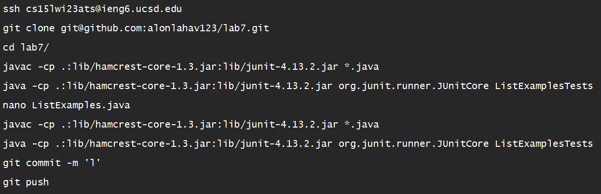
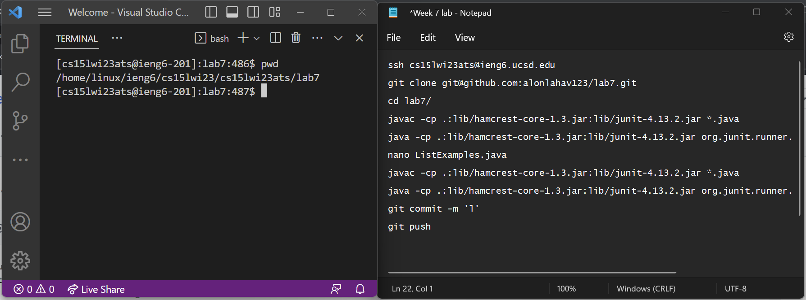
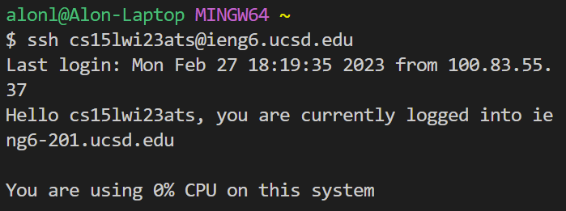
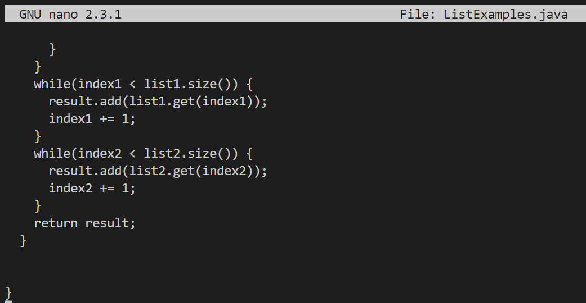
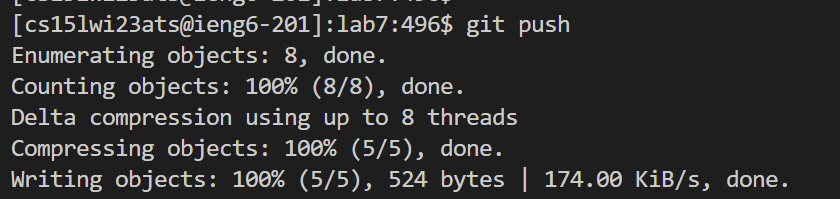

# Lab 4

In lab 4 we had a competition for who can do steps 4-9 the quickest, below are the listed steps:

1) Setup: Delete any existing forks of the repository you have on your account

2) Setup: Fork the [repository](https://github.com/ucsd-cse15l-w23/lab7)

3) The real deal: Start the timer!

4) Log into ieng6

5) Clone your fork of the repository from your Github account

6) Run the tests, demonstrating that they fail

7) Edit the code file to fix the failing test

8) Run the tests, demonstrating that they now succeed

9) Commit and push the resulting change to your Github account (you can pick any commit message!)

We were told that after some practice the TA's were able to complete the challege in under 5 minutes which became my goal. 

My first attempt took a little over 11 minutes but by the end I was able to complete the challenge in under 30 seconds which made me my group's champion.

My strategy comprised on creating a text document containing all the commands I needed to run and opening it side by side with my terminal copy and pasting the commands I wanted to run. This was the text document:



This is how I setup my windows for the competition:



Assuming I already completed the setup I start from step 4 do the following:

First I started by copying the ssh command from the text file and pasting it into my terminal as so:



This command will ssh into my account and because I already setup the authentication, I don't need to type my password in anymore.

Next I combine steps 5 through 7 as they can run independently from each other. I copy the following five lines and paste them into my terminal: 

```
git clone git@github.com:alonlahav123/lab7.git

cd lab7/

javac -cp .:lib/hamcrest-core-1.3.jar:lib/junit-4.13.2.jar *.java

java -cp .:lib/hamcrest-core-1.3.jar:lib/junit-4.13.2.jar org.junit.runner.JUnitCore ListExamplesTests

nano ListExamples.java 
```

This code clones the fork I had made earlier into my home directory that I am conencted to. Next it changes directory into the lab7 directory. Then it compiles all the java files as well as the needed libraries and afterwards runs the java file `ListExamplesTests` with the needed libraries. Finally I nano into ListExamples.java so that I can makes the changes required to fix the code so that all the tests pass.

Now that I am in the nano code editor, I press the <down arrow> key for a couple of seconds to go to the bottom of the file. Then I press the <up arrow> key seven times and press the <right arrow> key twelve times. Finally I press <backspace> once and then I press <2> once. This fixed the code from being:

```
while(index2 < list2.size()) {
    result.add(list2.get(index2));
    index1 += 1;
  }
return result;
```
To being: 
```
while(index2 < list2.size()) {
    result.add(list2.get(index2));
    index2 += 1;
  }
return result;
``` 


Then I save the changes by pressing <Ctrl>-<O> then <enter> and finally to exit I press <Ctrl>-<X> then <enter>
   
Now that I have fixed `ListExamples.java` I can recompile everything to make sure it works then commit and push my changes by copy and pasting the following lines:
    
```
javac -cp .:lib/hamcrest-core-1.3.jar:lib/junit-4.13.2.jar *.java

java -cp .:lib/hamcrest-core-1.3.jar:lib/junit-4.13.2.jar org.junit.runner.JUnitCore ListExamplesTests

git add .

git commit -m 'l'

git push
```



This will have completed steps 8 and 9 which is the end of the competition.
    
All in all, I managed to complete the task quickly because I got it down to 4 basic steps:
 - sh into my account
 - paste code to clone code plus compile, run, and enter text editor
 - go to end of file and change one character then save and exit
 - paste in the final commands to compile and run code then commit and push the code

