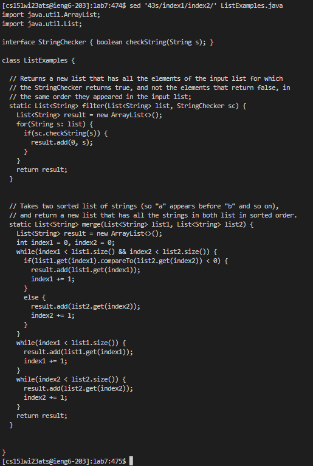
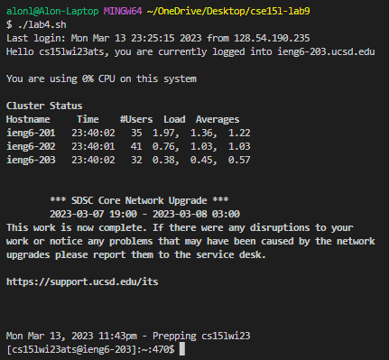
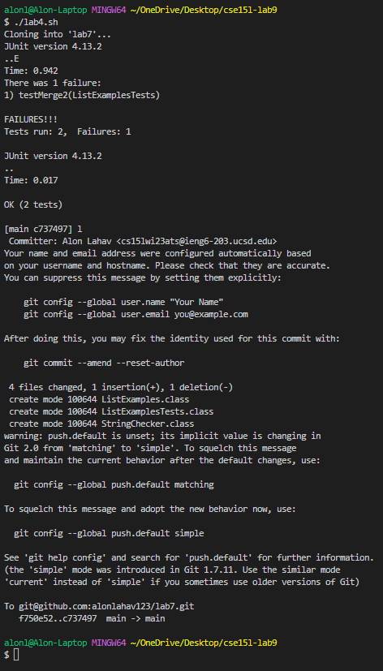

# Lab 5

For the final lab of CSE 15L I was assigned with going back to my favorite lab and doing a task in a new way so that I could apply a new idea to it.
I really enjoyed lab 7 / lab report 4 which was the lab where were learned how to do commands quickly. Initially it took me upwards of 12 minutes to complete
the entire list of tasks but with practice I got it down to 5 minutes, then 1 minutes, and then with a lot of copy and pasting down to ~30 seconds. Part of 
the reason I enjoyed this lab so much was because of the competition of it, I liked having to race against my group then against the top students in the class.
The winner of our class managed to do the list of tasks in ~2 seconds which made me realize there is a way to fully automate the process of this lab which
is why I was really excited for this lab report, a chance to fully automate what initially took me 12 minutes to complete. Using these times, if I was to
fully automate the list of tasks it would be an improvement of 36,000% which is what I ended up doing.

For a quick reminder, I listed the tasks that I needed to complete below (needed to do steps 4-9 the quickest):

### Tasks:
1) Setup: Delete any existing forks of the repository you have on your account

2) Setup: Fork the [repository](https://github.com/ucsd-cse15l-w23/lab7)

3) The real deal: Start the timer!

4) Log into ieng6

5) Clone your fork of the repository from your Github account

6) Run the tests, demonstrating that they fail

7) Edit the code file to fix the failing test

8) Run the tests, demonstrating that they now succeed

9) Commit and push the resulting change to your Github account (you can pick any commit message!)


### Initial Challenge:
The biggest challenge for this was to figure out a way to modify the `ListExamples.java` without using a text editor like `VIM` or `nano`.

I though of a lot of different ideas including deleting `ListExamples.java` and completely replacing it with a new file that contained the fixed code
but after some searching I learned about the `sed` command. 

This command is extremely powerful and one use of it is that it can find and replace a slice of text with another slice of text. This means given
the text I want to replace, `sed` can find it and replace it with the corrected code. This is great as I have to change a single character in 
`ListExamples.java` from a `1` to a `2` but it was not as simple as I expected. It took a lot of trial and error until I had learned enough about the 
command to where I could specify which `1` I was to place as this occured multiple times throughout the text. This is the command I ended up using:

`sed -i '43s/index1/index2/' ListExamples.java`

- `-i` flag will edit the given file as without it sed returns the edited text into the command line.
- `43s` the "s" tells sed that it is doing a substitution with the following two inputs and the "43" specifies which line in the given file to edit
- `index1` is the pattern that sed is looking to replace
- `index2` is the replacement text
- `ListExamples.java` is the input file 

This is what `sed` looks like without the `-i` flag:



### Second Challenge:
Now with this command in my arsenal I was able to do all the tasks by copy and pasting commands into the command line, unlike before where I had to 
maneuver inside the nano text editor. I was now able to put all of the commands into one bash file which is when I ran into my second problem. 



After executing the SSH command, all the other commands were not being run as shown above. This confused me so I tried to just copy and paste all the commands and 
found that the same issue was happening. After some research I found that in order to run commands after you SSH into a server you need to put them into
a string after the SSH file and after doing that I got the following bash script to complete all of the needed tasks!

### Final Script
```
#!/bin/bash

ssh cs15lwi23ats@ieng6.ucsd.edu "

        git clone git@github.com:alonlahav123/lab7.git

        cd lab7/

        javac -cp .:lib/hamcrest-core-1.3.jar:lib/junit-4.13.2.jar *.java

        java -cp .:lib/hamcrest-core-1.3.jar:lib/junit-4.13.2.jar org.junit.runner.JUnitCore ListExamplesTests

        sed -i '43s/index1/index2/' ListExamples.java

        javac -cp .:lib/hamcrest-core-1.3.jar:lib/junit-4.13.2.jar *.java

        java -cp .:lib/hamcrest-core-1.3.jar:lib/junit-4.13.2.jar org.junit.runner.JUnitCore ListExamplesTests

        git add .

        git commit -m 'l'

        git push
"
```

This is how it looked like in the terminal:




After final confirmations that it ran all the correct commands as well as committing and pushing the fix to the java code, I am happy to say that I have fully automated a task that initially took me 12 minutes down to a single bash script!

I really enjoyed this lab as it gave me a chance to go back and spend some more time trying new things which led me to discover the `sed` command as well as sharpen my skills with bash scripts and sshing.
